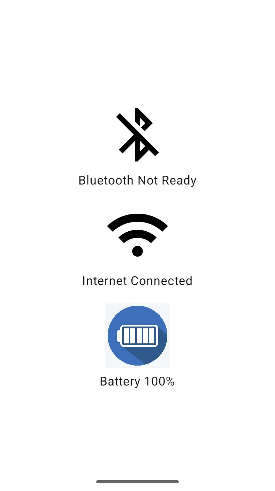
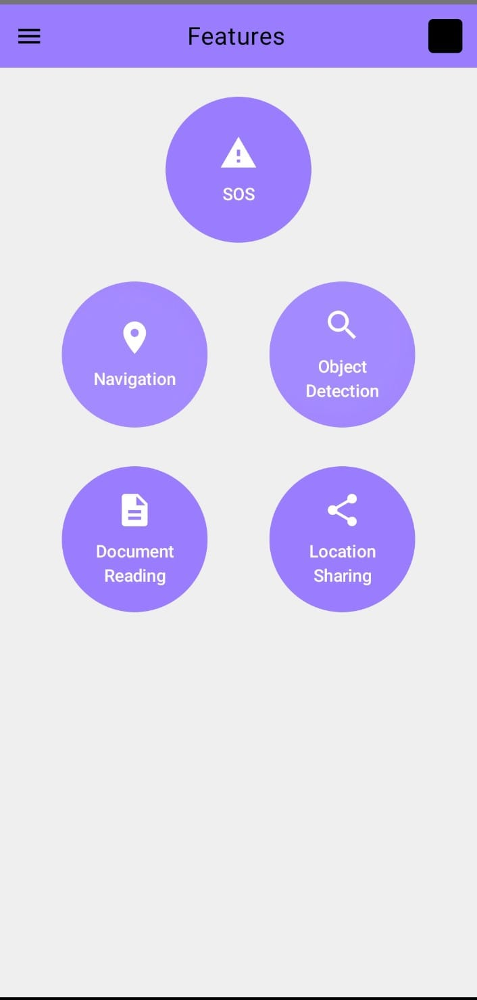

# Smart Sight: Assistive Smart Glasses for the Visually Challenged

Smart Sight is an innovative project focused on developing smart glasses designed to assist visually challenged individuals. The goal of this project is to leverage advanced technologies such as computer vision, audio feedback, and real-time object detection to enhance the independence and quality of life for people with visual impairments.

---

## Key Features
- Object Detection – Capture and identify objects in the user’s environment.  
- Location Sharing – Share live GPS location with caregivers.  
- SOS – Emergency alert feature.  
- Document Reading – OCR for reading printed text aloud.  
- Navigation – Provide step-by-step navigation assistance.  

---

## Project Vision
Smart Sight aims to bridge the accessibility gap by empowering visually challenged persons with greater mobility, awareness, and confidence in their surroundings.

---

## Hardware List
- Seeed Studio XIAO ESP32-S3 Sense  
- 3.7V Li-Po rechargeable battery  
- Android phone (minimum SDK 24)  
- Supporting Components  
  - Smart glasses frame  
  - Jumper wires  

---

## Software Dependencies

### Android App Development
- **IDE:** Android Studio Narwhal | 2025.1.1 or later  
- **Language:** Kotlin | 1.9.0 or higher | Language used for Android development  
- **Framework:** Jetpack Compose | 1.6.0 or higher | UI framework  
- **Minimum Android Version:** Android 7.0 (API Level 24)  

### ESP32 Firmware
- **IDE:** Arduino IDE 2.3.3 or later  
- **Board Manager URL:** `https://dl.espressif.com/dl/package_esp32_index.json`  
- **Board Selected:** Seeed Studio XIAO ESP32S3 Sense  

---

## Hardware Connection Schematics

The current prototype of Smart Sight uses the **Seeed Studio XIAO ESP32-S3 Sense**, which has the **OV2640 camera module integrated directly onto the board**.  
As of now, no external wiring is required between the ESP32 and the camera module.

### Notes
- All connections are handled internally on the **XIAO ESP32-S3 Sense** board.  
- No external jumper wires or breadboard setup is required for camera operation.  
- Power is provided either through **USB Type-C** (for development) or a **3.7V Li-Po battery** connected to the onboard battery terminals.  
- The board communicates with the Android app over **Wi-Fi** using a **WebSocket server**.

---
### ESP32-S3 Main Specifications
- **Processor:** Dual-core Xtensa LX7 @ 240 MHz  
- **Memory:** 8 MB PSRAM  
- **Storage:** 4 MB Flash  
- **Connectivity:** Wi-Fi 802.11 b/g/n, Bluetooth 5.0 (BLE)  
- **Camera:** Integrated OV2640 module  
- **Power Supply:** 3.3V (via USB Type-C or Li-ion battery)  
---

## Status Page

The Status Page is the entry point of the Smart Sight app.  
It checks device readiness (Bluetooth, Internet, Battery) before allowing the user to access the main features, ensuring reliability and a smooth user experience.  

---

### System Architecture

**Hardware (Android Device)**  
- Provides Bluetooth, WiFi, and battery data to the Smart Sight app.  
- Supplies real-time updates on system conditions required for navigation.  

**Android App (Status Page)**  
- Built with Kotlin + Jetpack Compose.  
- Continuously monitors Bluetooth, Internet, and Battery.  
- Displays current status with icons and percentage values.  
- Automatically navigates to the Features screen once conditions are satisfied.  

---

### Key Files

**Android App (Kotlin)**  
- `AppScreen.kt` – Implements the Status Page.  
  - Initializes system checks (Bluetooth, Internet, Battery).  
  - Runs a polling loop to continuously update states.  
  - Handles auto-navigation to the Features screen.  
- `isBluetoothReadyAndDevicePaired()` – Checks if Bluetooth is enabled and a paired device exists.  
- `isInternetConnected()` – Validates network connectivity.  
- `batteryPercent()` – Retrieves the phone’s battery percentage.  

---

### Workflow

1. **App Launch**  
   - Status Page loads and initializes system checks.  

2. **Condition Monitoring**  
   - Checks Bluetooth readiness.  
   - Validates Internet connectivity.  
   - Reads current battery percentage.  
   - Polling loop re-checks every 1.5 seconds.  

3. **Navigation Logic**  
   - If Bluetooth and Internet are ready → auto-navigate to Features screen.  
   - Otherwise → stay on Status Page and display status indicators.  

---
## Screenshots
| Before Connection                                  |   After Connection                             |
|----------------------------------------------------|------------------------------------------------|
|||

---
## Object Detection Feature

### System Architecture

**Hardware (ESP32-S3 Sense)**  
- Acts as a WebSocket server on port 8888
- Captures images using its OV2640 camera sensor
- On receiving a "capture" command from the Android app, it:
          - Captures a frame
          - Compresses it into JPEG
          - Sends the byte stream to the Android application in real time 

**Android Application**  
- Built with Kotlin + Jetpack Compose
- Contains the Object Detection Screen for:
          - Sending capture commands
          - Receiving live JPEG image frames over WebSocket
          - Rendering preview on the UI
- Uses the custom ESPWebSocketClient class for high-speed, low-latency communication
- Converts incoming JPEG bytes into a Bitmap via BitmapFactory.decodeByteArray()
- Displays the received frame on screen

---

**Object Processing Pipeline (ML Kit Image Labeling)**

After decoding the received image into a Bitmap, the app performs object recognition using:
- Google ML Kit – Image Labeling API
- On-device processing (no internet required)

**Steps**
- The received image frame is converted into an InputImage.
- ML Kit runs a lightweight object classifier and produces a list of labels with confidence scores.
- These detected objects are:
          - Displayed on the screen
          - Stored in a dynamic result list
          - Forwarded to Text-to-Speech to be spoken aloud for visually challenged users

**Example Output**

If a chair, bottle, and laptop are present:

         Detected Objects: Chair, Bottle, Laptop

These labels are then announced aloud through the system TTS engine.

**Text-to-Speech Output (Read Aloud)**

To assist visually challenged users, Smart Sight converts the detected object labels into speech.

**How it works:**
- The result list from ML Kit is joined into a readable sentence
- Android TextToSpeech engine speaks the result automatically
- Speech is clear, concise, and triggered instantly after object detection

**Example:**

If ML Kit detects → ["Chair", "Bottle"]

The app speaks:
         
         “Chair, Bottle detected.”

This allows the user to understand their surroundings without needing to view the screen.

## Key Files

### ESP32 (Arduino)
1.[main.ino](Arduino_code/main.ino) – WiFi connection, WebSocket server setup, Camera initialization & image capture

### Android App (Kotlin)
1. [MainActivity.kt](app/src/main/java/com/example/smartsight/MainActivity.kt) – App entry & navigation  
2. [ObjectDetectionScreen.kt](app/src/main/java/com/example/smartsight/ObjectDetectionScreen.kt)– UI for capture + Preview + Detects object + Read aloud  
3. [SendPhoto.kt](app/src/main/java/com/example/smartsight/SendPhoto.kt) – Receives image from ESP32 ans sends it to app UI  
4. [SharedViewModel.kt](app/src/main/java/com/example/smartsight/SharedViewModel.kt) – Centeralized webSocket handling 
---

## Installation & Setup

### ESP32 Setup
1. Install Arduino IDE with ESP32S3 Sense board support.  
   (For a detailed walkthrough, refer to this video: [https://www.youtube.com/watch?v=JlnV3U3Rx7k](https://www.youtube.com/watch?v=JlnV3U3Rx7k))  
2. Flash [main.ino](Arduino_code/main.ino) to ESP32-S3 Sense.  
3. Update WiFi SSID & password inside the sketch.  
4. After boot, note the printed IP address in Serial Monitor.  

### Android App Setup
1. Clone this repository.  
2. Open project in Android Studio.  
3. Update the ESP32 IP in [ESPWebSocketClient.kt](app/src/main/java/com/example/smartsight/ESPWebSocketClient.kt).  
4. Build & run the app on an Android device.  

---

## Object Detection Demo Video

---

### Flow Chart

---

## Location Sharing Feature

The Location Sharing module enables visually challenged users to safely and quickly share their real-time GPS location with trusted contacts. This system is designed with reliability, simplicity, and accessibility in mind — ensuring that help can be reached when needed.

### System Architecture

**Android Application**

The Android app handles:
- Real-time GPS location acquisition
- Contact group creation
- Priority list management
- Sharing location via SMS or preferred communication channel

**Core Components**

The Location Sharing module consists of:

**1. GPS Location Fetching**

Uses Android’s FusedLocationProviderClient

Retrieves:
      - Latitude
      - Longitude

Locations are fetched only with explicit permission from the user.

**2. Contact Management**

Users can manage contacts in three ways:

**A. Create List**
- User adds multiple contacts
- Assigns a custom group name
- Stores the list locally for repeated use
- Allows users to create reusable groups of contacts
(e.g., “Family”, “Emergency Team”)

**B. Priority List**
- Contains pre-saved emergency contacts
- Automatically used during the SOS Emergency Feature
- Used by default for SOS-triggered alerts
Contains most important contacts

**C. Select a Contact**
- Choose a single person from the saved contacts
- Ideal for one-time sharing
- For sending location to a single person

All contact lists are stored securely within the device.

---

**Location Sharing Workflow**

After selecting contact(s), the user presses the Share (≻) button.
The app then:

  - Fetches real-time GPS coordinates
  - Formats a clean, readable location message
  - Sends it to all selected contacts

**Example message:**

      Smart Sight Location Update:
      Latitude: xx.xxxxx
      Longitude: yy.yyyyy
      Google Maps Link: https://maps.google.com/?q=xx.xxxxx,yy.yyyyy

**Steps to Use Location Sharing**
1. Open Location Sharing from the home screen
2. Choose from:
       - Create List
       - Priority List
       - Select a Contact
3. Select one or more recipients
4. Tap the Share (≻) button
5. App collects GPS data
6. Sends the formatted location message

**Requirements for Proper Functioning**
- GPS must be turned ON
- SMS permission must be granted (if sharing via SMS)
- Internet connection (optional but helpful for maps link resolution)
---

## Key Files

### Android App (Kotlin)
1. [MainActivity.kt](app/src/main/java/com/example/smartsight/MainActivity.kt) – App entry & navigation  
2. [LocationSharing.kt](app/src/main/java/com/example/smartsight/LocationSharing.kt)– UI for sharing location

---

**Android App Setup**

Follow these steps to enable and test the Location Sharing feature inside the app:

1. Clone the Repository

Download or clone the complete project to your local machine.

2. Open in Android Studio

Open the project folder in Android Studio Hedgehog or above.

3. Enable Required Permissions

Ensure the following permissions are declared in AndroidManifest.xml:

    <uses-permission android:name="android.permission.ACCESS_FINE_LOCATION" />
    <uses-permission android:name="android.permission.ACCESS_COARSE_LOCATION" />
    <uses-permission android:name="android.permission.INTERNET" />

4. Build & Run the App on an Android Device

## Location Sharing Demo Video

---

## SOS Emergency Alert Feature

The SOS system provides an instant emergency alert mechanism for visually challenged users. Unlike typical app-based SOS buttons, Smart Sight uses a physical push-button built into the wearable glasses, ensuring the user can activate help without needing to operate the phone interface.

When the button on the ESP32 Smart Glasses is pressed, the event is transmitted to the mobile application through a WebSocket connection. The app immediately retrieves the user’s current location and automatically shares it with the saved emergency contacts in the Priority List.

This guarantees a fast, reliable, and hands-free emergency alert process.

### System Architecture

**1. Hardware (ESP32-S3 with Pushbutton)**
- ESP32 runs a WebSocket server on a predefined port
- A dedicated physical pushbutton is connected to a GPIO pin
- On button press:
        - ESP32 sends a WebSocket message like "SOS_button" to the Android app
        - No image capture or camera processing involved
- Requires only WiFi connection (same network as the Android app)

This design ensures the SOS trigger is accessible, fast, and independent of the phone UI.

**2. Android Application Logic**

When the app receives "SOS_button" from the ESP:

**a. WebSocket Listener**
- Continuously listens for incoming messages from ESP32
- If the message equals "SOS_button" → SOS workflow begins automatically

**b. Location Fetching**

Uses Fused Location Provider to get:

     - Latitude
     - Longitude
     - Google Maps shareable link

**c. Location Delivery**
- The app automatically sends the user’s current location to:
- All contacts saved in the Priority List under Location Sharing feature
- The message includes:
      - Emergency alert text
      - Full location details
      - Maps link

This runs without requiring any touch interaction from the user.

---

### How SOS Works (Internal Workflow)

1. User presses the pushbutton on Smart Sight glasses
2. ESP32 detects the interrupt and sends:

       SOS_button

to the app through WebSocket

3. Android app receives this message instantly
4. App fetches location (GPS / network-based)
5. App formats emergency message including:

       EMERGENCY ALERT!
       I need immediate help.
       Latitude: xx.xxxxx
       Longitude: yy.yyyyy
       Google Maps Link: https://maps.google.com/?q=xx.xxxxx,yy.yyyyy

6. App sends the location to all Priority List contacts
7. Everything happens automatically within a few seconds.

---

## Key Files

### ESP32 (Arduino)
1.[main.ino](Arduino_code/main.ino) – WiFi setup, WebSocket server, Pushbutton GPIO interrupt, Sends "SOS_button" message upon button press

### Android App (Kotlin)
1. [MainActivity.kt](app/src/main/java/com/example/smartsight/MainActivity.kt) – App entry & navigation  
2. [LocationSharing.kt](app/src/main/java/com/example/smartsight/LocationSharing.kt)– UI for addind contacts in priority list   
3. [SharedViewModel.kt](app/src/main/java/com/example/smartsight/SharedViewModel.kt) – Triggers SOS feature by sending "SOS_button" through websockets to the app

---

## Installation & Setup

**ESP32 Setup**
1. Install ESP32 board in Arduino IDE
2. Flash the main.ino file
3. Connect pushbutton to configured GPIO pin
4. Update WiFi credentials
5. Ensure ESP and Android device are on the same WiFi network
6. Confirm WebSocket initializes and prints "Waiting for client..."

**Android App Setup**
1. Clone the repository and open in Android Studio
2. Update ESP32 WebSocket IP address in ESPWebSocketClient.kt
3. Add Priority contacts in the Location Sharing section
4. Install the app on an Android device
5. Turn ON GPS for accurate SOS updates

## SOS Demo Video

## Existing Bugs

1. Dynamic IP problem
2. Auto connection of websockets - when websocket is disconnected, app needs to restart to initiate connection again.
3. App will not work in background.
4. Latency while fetching image from the camera

## Future development Ideas

1. Voice assistant navigation feature
2. Voice assistant document reading feature
3. Accessibility of implemented features through voice command
4. Make app to run in background
