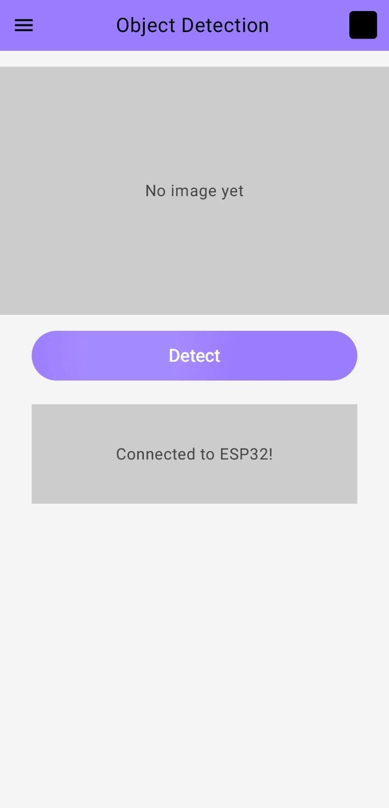

# Smart Sight: Assistive Smart Glasses for the Visually Challenged

Smart Sight is an innovative project focused on developing smart glasses designed to assist visually challenged individuals. The goal of this project is to leverage advanced technologies such as computer vision, audio feedback, and real-time object detection to enhance the independence and quality of life for people with visual impairments.

## Key Features
Object Detection – Capture and identify objects in the user’s environment.  
Location Sharing – Share live GPS location with caregivers.  
SOS – Emergency alert feature.  
Document Reading – OCR for reading printed text aloud.  
Navigation – Provide step-by-step navigation assistance.

## Project Vision
Smart Sight aims to bridge the accessibility gap by empowering visually challenged persons with greater mobility, awareness, and confidence in their surroundings.

---
## Object Detection
### System Architecture
### Hardware (ESP32-S3 Sense)

- Acts as a WebSocket server (port 8888).  
- Captures images via onboard camera using the ESP32 camera driver.  
- On receiving a capture command, returns a JPEG image buffer.  

### Android App
- Built with Kotlin + Jetpack Compose.  
- Provides UI screens for each feature.  
- Uses ESPWebSocketClient class to communicate with ESP32.  
- Decodes received JPEG bytes into a Bitmap and renders in the Object Detection Screen.

## Key Files
### ESP32 (Arduino)

1) main.ino - WiFi connection, WebSocket server setup, Camera initialization & image capture

### Android App (Kotlin)

1) MainActivity.kt – App entry & navigation  
2) ObjectDetectionScreen.kt – UI for capture + preview  
3) SendPhoto.kt – WebSocket handling

## Installation & Setup
### ESP32 Setup

1) Install Arduino IDE with ESP32S3 Sense board support.  
2) Flash main.ino to ESP32-S3 Sense.  
3) Update WiFi SSID & password inside the sketch. 
4) After boot, note the printed IP address in Serial Monitor.

### Android App Setup

1) Clone this repository.  
2) Open project in Android Studio.  
3) Update the ESP32 IP in ESPWebSocketClient.kt.  
4) Build & run the app on an Android device.

## Screenshots

For more details, please refer to the project documentation and future updates.
