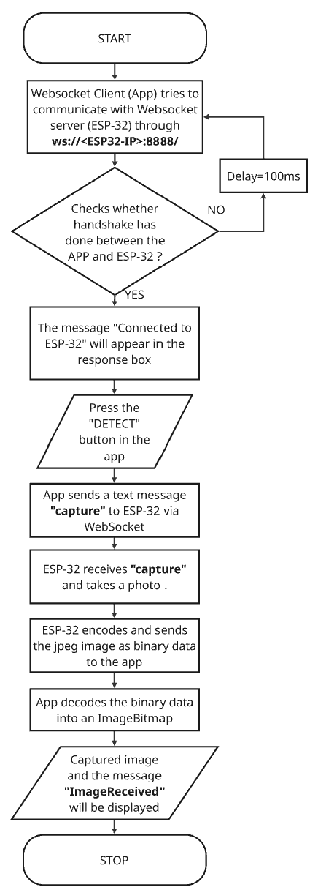

# Smart Sight: Assistive Smart Glasses for the Visually Challenged

Smart Sight is an innovative project focused on developing smart glasses designed to assist visually challenged individuals. The goal of this project is to leverage advanced technologies such as computer vision, audio feedback, and real-time object detection to enhance the independence and quality of life for people with visual impairments.

---

## Key Features
- Object Detection – Capture and identify objects in the user’s environment.  
- Location Sharing – Share live GPS location with caregivers.  
- SOS – Emergency alert feature.  
- Document Reading – OCR for reading printed text aloud.  
- Navigation – Provide step-by-step navigation assistance.  

---

## Project Vision
Smart Sight aims to bridge the accessibility gap by empowering visually challenged persons with greater mobility, awareness, and confidence in their surroundings.

---

## Hardware List
- Seeed Studio XIAO ESP32-S3 Sense  
- 3.7V Li-Po rechargeable battery  
- Android phone (minimum SDK 24)  
- Supporting Components  
  - Smart glasses frame  
  - Jumper wires  

---

## Software Dependencies

### Android App Development
- **IDE:** Android Studio Narwhal | 2025.1.1 or later  
- **Language:** Kotlin | 1.9.0 or higher | Language used for Android development  
- **Framework:** Jetpack Compose | 1.6.0 or higher | UI framework  
- **Minimum Android Version:** Android 7.0 (API Level 24)  

### ESP32 Firmware
- **IDE:** Arduino IDE 2.3.3 or later  
- **Board Manager URL:** `https://dl.espressif.com/dl/package_esp32_index.json`  
- **Board Selected:** Seeed Studio XIAO ESP32S3 Sense  

---

## Hardware Connection Schematics

The current prototype of Smart Sight uses the **Seeed Studio XIAO ESP32-S3 Sense**, which has the **OV2640 camera module integrated directly onto the board**.  
As of now, no external wiring is required between the ESP32 and the camera module.

### Notes
- All connections are handled internally on the **XIAO ESP32-S3 Sense** board.  
- No external jumper wires or breadboard setup is required for camera operation.  
- Power is provided either through **USB Type-C** (for development) or a **3.7V Li-Po battery** connected to the onboard battery terminals.  
- The board communicates with the Android app over **Wi-Fi** using a **WebSocket server**.

---

## Object Detection

### System Architecture

**Hardware (ESP32-S3 Sense)**  
- Acts as a WebSocket server on port `8888`  
- Captures images through its onboard **OV2640** camera sensor  
- On receiving a `capture` command, it transmits a compressed JPEG buffer to the connected Android client  

**Android Application**  
- Built with Kotlin and Jetpack Compose  
- Contains the Object Detection screen responsible for image acquisition  
- Uses the `ESPWebSocketClient` class for real-time communication with the ESP32  
- Decodes incoming JPEG bytes into a `Bitmap` and renders the image on screen  

---

### ESP32-S3 Main Specifications
- **Processor:** Dual-core Xtensa LX7 @ 240 MHz  
- **Memory:** 8 MB PSRAM  
- **Storage:** 4 MB Flash  
- **Connectivity:** Wi-Fi 802.11 b/g/n, Bluetooth 5.0 (BLE)  
- **Camera:** Integrated OV2640 module  
- **Power Supply:** 3.3V (via USB Type-C or Li-ion battery)  

---

## Key Files

### ESP32 (Arduino)
1.[main.ino](Arduino_code/main.ino) – WiFi connection, WebSocket server setup, Camera initialization & image capture

### Android App (Kotlin)
1. `MainActivity.kt` – App entry & navigation  
2. `ObjectDetectionScreen.kt` – UI for capture + preview  
3. `SendPhoto.kt` – WebSocket handling  

---

## Installation & Setup

### ESP32 Setup
1. Install Arduino IDE with ESP32S3 Sense board support.  
   (For a detailed walkthrough, refer to this video: [https://www.youtube.com/watch?v=JlnV3U3Rx7k](https://www.youtube.com/watch?v=JlnV3U3Rx7k))  
2. Flash `main.ino` to ESP32-S3 Sense.  
3. Update WiFi SSID & password inside the sketch.  
4. After boot, note the printed IP address in Serial Monitor.  

### Android App Setup
1. Clone this repository.  
2. Open project in Android Studio.  
3. Update the ESP32 IP in `ESPWebSocketClient.kt`.  
4. Build & run the app on an Android device.  

---

## Object Detection Demo Video

---

### Flow Chart

